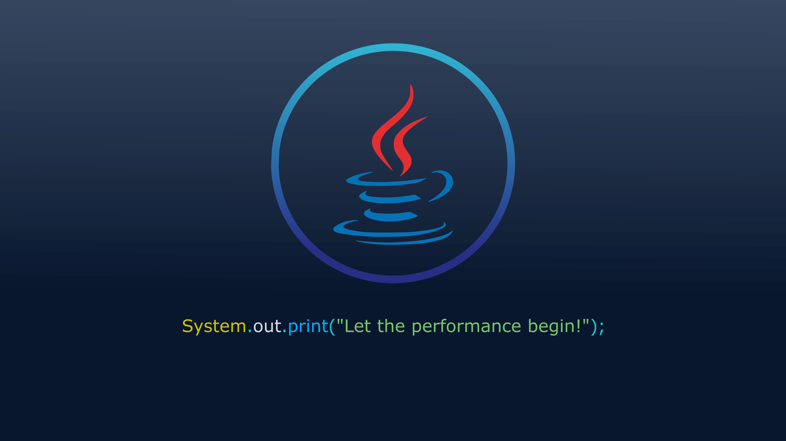

<h1 align="center"> Estudos de Java </h1>

Este repositório tem a intenção de registrar meus estudos em Java.  
  

  <a href="#-tecnologias">Tecnologias</a>&nbsp;&nbsp;&nbsp;|&nbsp;&nbsp;&nbsp;
  <a href="#-projeto">Projetos</a>&nbsp;&nbsp;&nbsp;|&nbsp;&nbsp;&nbsp;
  <a href="#-layout">Sugestões</a>&nbsp;&nbsp;&nbsp;|&nbsp;&nbsp;&nbsp;
  <a href="#memo-licença">Licença</a>

  

## 🚀 Tecnologias

Meus estudos e projetos de aprendizado estão sendo desenvolvidos com as seguintes tecnologias:

- Java versão 20.0.2 da JDK
- IDE IntelliJ

## 💻 Projetos

O projeto contém exercícios e aplicações de estudo que vou desenvolvendo conforme meu aprendizado avança. 

Cada pasta é referente a um projeto diferente.

## 🔖 Sugestões

Se você visualizou alguns desses projetos e puder me dar dicas de como melhorar, sinta-se a vontade! Eu vou ficar bem agradecido em receber qualquer dica de estudo e sugestões para melhorar meu aprendizado.

## :memo: Licença

Esse projeto está sob a licença MIT.

---